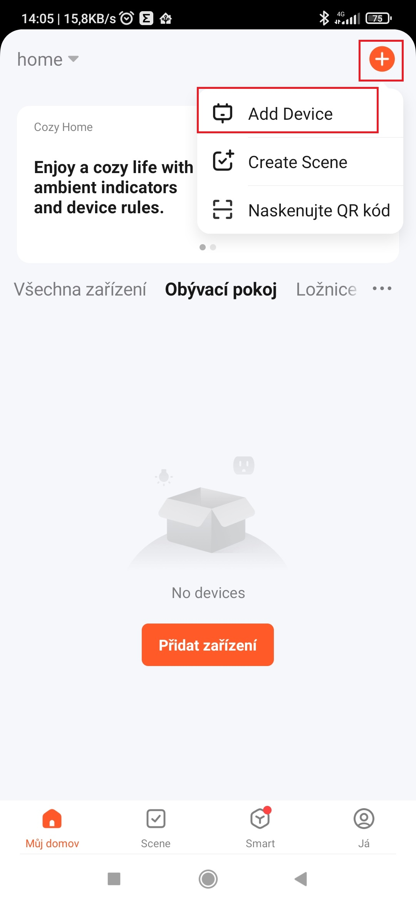

# Integrace Concept OV2220 Perfect Air Smart do Home Assistant přes Localtuya

  
## Požadavky

  - PC s windows
  - mobilní telefon s aplikací tuya
  - přístup do https://iot.tuya.com návod na vytvotvoření projektu -> https://www.home-assistant.io/integrations/tuya
  - Nainstalovaná integrace <a href="https://github.com/rospogrigio/localtuya/">localtuya</a> v Home Assistant

## Spárování odvlhčovače s tuya aplikací

**Odeberte odvlhčovač ze všech aplikací, s kterými jste ho spárovali (například concept home)**

- v mobilním telefonu otevřít aplikaci Tuya Smart
- dát volbu přidat zařízení (v levém horním rohu)

  

## Získání device id a local key
