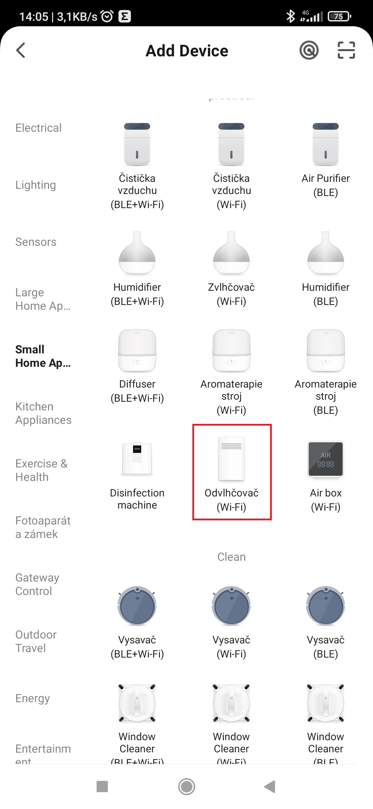

# Integrace Concept OV2220 Perfect Air Smart do Home Assistant přes Localtuya

<p align="center">

</p>
  
## Požadavky

  - PC s windows
  - mobilní telefon s aplikací tuya
  - přístup do https://iot.tuya.com návod na vytvotvoření projektu -> https://www.home-assistant.io/integrations/tuya
  - Nainstalovaná integrace <a href="https://github.com/rospogrigio/localtuya/">localtuya</a> v Home Assistant

## Spárování odvlhčovače s tuya aplikací

**Odeberte odvlhčovač ze všech aplikací, s kterými jste ho spárovali (například concept home)**

**Pro spárování je nutné přepnout odvlhčovač do režimu párování. Odvlhčovač se do režimu párování přepne stisknutím tlačítka režimu ve vypnutém stavu -> začne blikat symbol wifi. **

- v mobilním telefonu otevřít aplikaci Tuya Smart
- dát volbu přidat zařízení (v levém horním rohu)

<p align="center">

</p>

- v seznamu zařízení najít "Odvlhčovač Wi-fi"

<p align="center">

</p>

- zadejte údaje ke své wifi

<p align="center">

</p>

- následně ze seznamu zařízení vyberat OV2220 a zařízení bude spárováno s Tuya

## Získání device id a local key


- vrácený výsledek

```json
{
  "result": {
    "active_time": 1675787210,
    "category": "cs",
    "category_name": "Dehumidifier",
    "create_time": 1670774269,
    "gateway_id": "",
    "icon": "smart/product_icon/cs.png",
    "id": "10017508483fda31449a",
    "ip": "85.160.0.131",
    "lat": "49.5883",
    "local_key": "6x3375e2v9d67cb9",
    "lon": "14.1600",
    "model": "OV2220",
    "name": "OV2220",
    "online": true,
    "owner_id": "45828380",
    "product_id": "uag0ftgtowvsxfk8",
    "product_name": "OV2220",
    "sub": false,
    "time_zone": "+01:00",
    "update_time": 1675787217,
    "uuid": "10017508483fda31449a"
  },
  "success": true,
  "t": 1675862725017,
  "tid": "0b97d8d1a7bc11ed9de742b33a3cd862"
}
```

