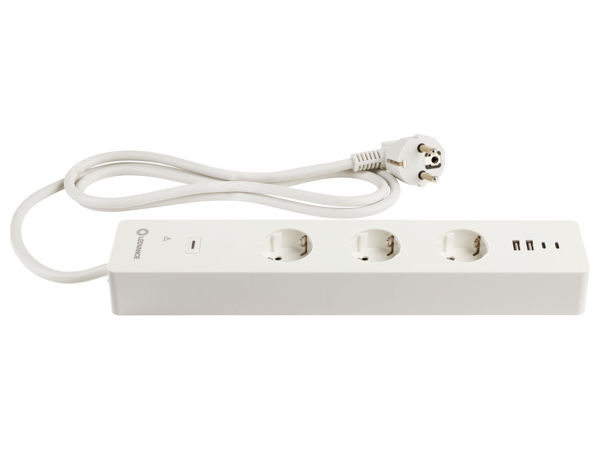
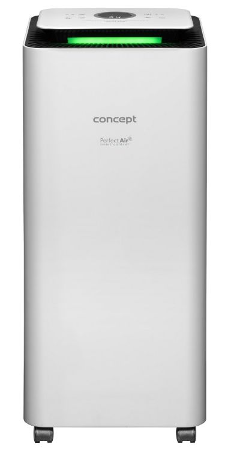

# hassio-localtuya-my-device-configuration
Manuály integrace zařízení přes localtuya do home-assistant.

## Zařízení: 

  - [Ledvance WiFi zásuvková lišta s USB](ledvance-multipower-socket/README.md)
  
  

  
  - [Odvlhčovač vzduchu Concept OV2220 Perfect Air Smart](Concept-OV2220-Perfect-Air-Smart/README.md) 
  
  

  
  - Solight LED SMART WIFI žárovka, miniglobe, e14
