# Integrace Solight LED SMART WIFI žárovky, miniglobe, E14, RGB (wz432) do Home Assistant přes Localtuya

<p align="center">
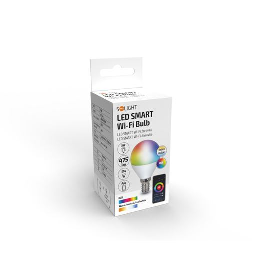
</p>
  
## Požadavky

  - PC s přístupem na internet
  - mobilní telefon s aplikací tuya
  - přístup do https://iot.tuya.com návod na vytvoření projektu -> https://www.home-assistant.io/integrations/tuya
  - Nainstalovaná integrace <a href="https://github.com/rospogrigio/localtuya/">local tuya</a> v Home Assistant

## Spárování žárovky s tuya aplikací

 - žárovku spárovat dle oficiálního návodu s Tuya Smart aplikací

## Získání device id a local key

- přihlásit se do https://iot.tuya.com zde najít svůj projekt s žárovkou, kde je device id

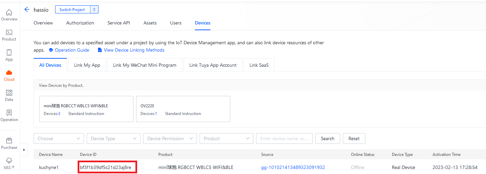

- zkopírovat device id a přepnout se do API Explorer

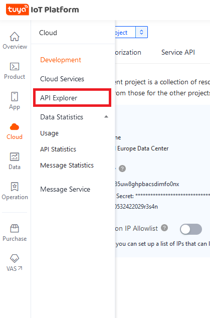

- přepnutí do API "General devices management" -> "Get device information"
- vyplnit device ID a enter

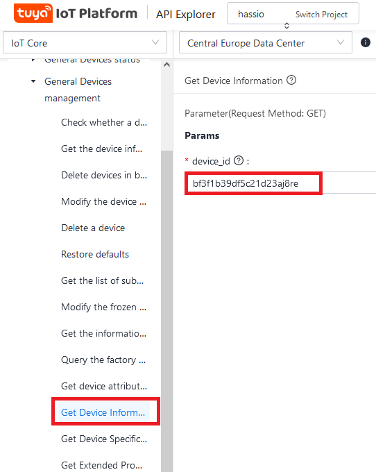

- v pravé části okna by měl být podobný výsledek

```json
{
  "result": {
    "active_time": 1676305734,
    "category": "dj",
    "category_name": "Light Source",
    "create_time": 1640249606,
    "gateway_id": "",
    "icon": "smart/icon/ay1533018995496fyz5R/f9aa2fe9bea9c090198f9b8013a85d79.png",
    "id": "bf3f1b39df5c21d23aj8re",
    "ip": "85.160.0.98",
    "lat": "50.5884",
    "local_key": "9c8d9ea13e5d3ec0",
    "lon": "15.1599",
    "model": "mini RGBCCT  WBLC5",
    "name": "kuchyne1",
    "online": false,
    "owner_id": "45828380",
    "product_id": "9xndqcwqsourp0fk",
    "product_name": "C37 Smart mini RGBCCT bulb",
    "sub": false,
    "time_zone": "+01:00",
    "update_time": 1676305734,
    "uuid": "65bff9dccc04e0df"
  },
  "success": true,
  "t": 1676545473970,
  "tid": "b1b44883ade911ed954a4e3668f00a74"
}

```
- vykopírovat local_key

## Přidání do Home Assistant

  - otevřít Home Assistant -> Nastavení -> Zařízení
  - najít položku localtuya -> Nastavit

  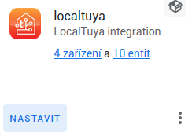
 
  - vybrat volbu add a new device

  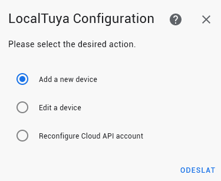
  
  - vybrat 

  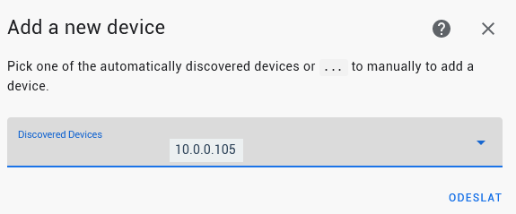
  
  - nastavení zařízení: zadání názvu zařízení a local key vašeho zařízení, případně zadat ještě scan interval
  
  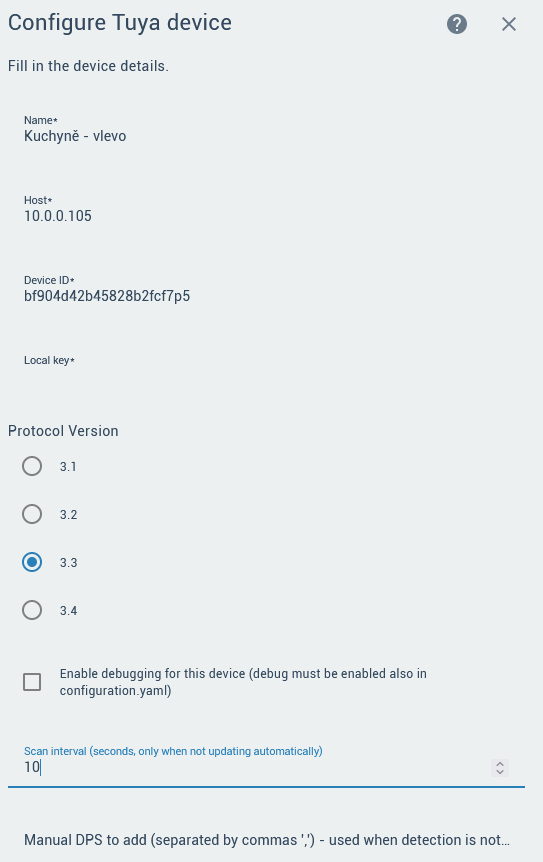
  
  - vybrat typ light
  
  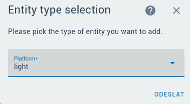
  
  - nastavit entitu
  
  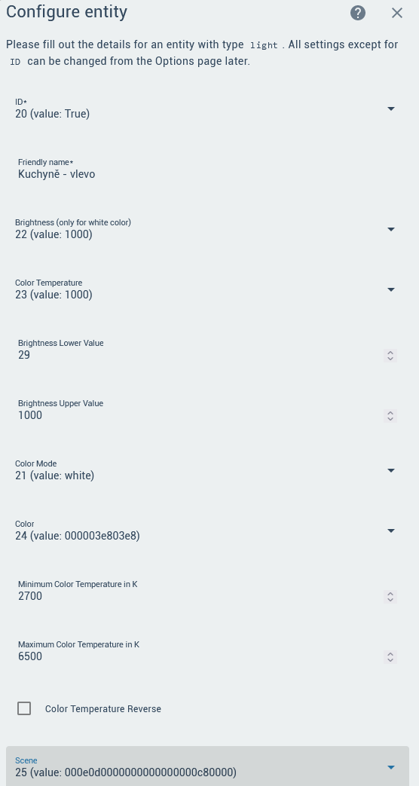

  - po přídání entity necháme volbu zaškrtnutou "Do not add any more entities"

  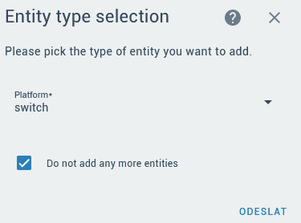
  
## Výsledek v Home Assistant

  - nějak takto by mělo vypadat přidané zařízení
  
  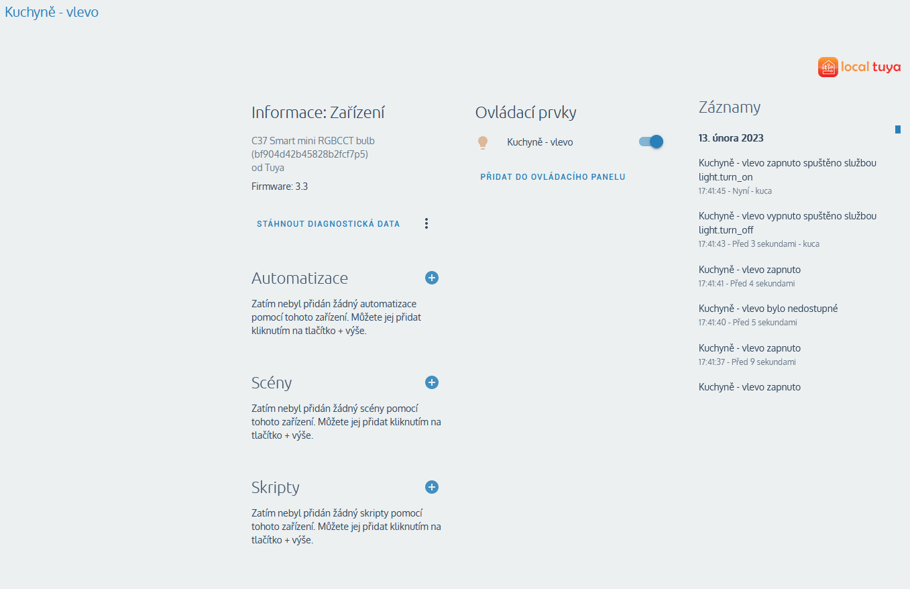  

## Zdroje

  - https://github.com/rospogrigio/localtuya/
  - https://developer.tuya.com/en/docs/iot/product-function-definition?id=K9s9rhj576ypf
