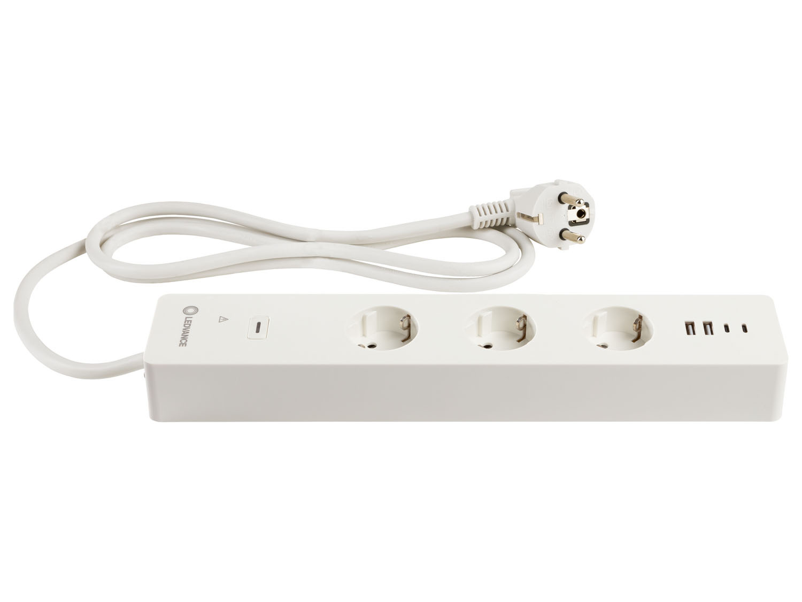
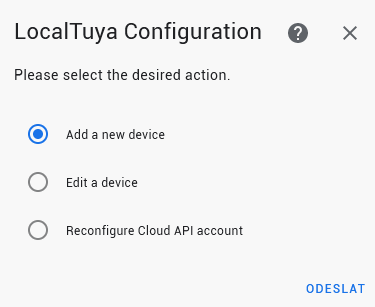

# Integrace Ledvance WiFi zásuvkové lišty s USB do Home Assistant přes Localtuya

<p align="center">

</p>
  
## Požadavky

  - PC s windows
  - Nainstalovaná integrace <a href="https://github.com/rospogrigio/localtuya/">local tuya</a> v Home Assistant

## Získání device id a local key

  - zařízení spárovat s účtem LDV Wifi (aplikace wifi smart+)
  - Instalace pythonu -> z microsoft store, poslední verzi
  - Otevřít příkazovou řádku a nainstalovat request a pycryptodome
  
  ```cmd
  
    pip install requests 
    pip install pycryptodome
  
  ```
  
  - stáhnout a rozbalit https://github.com/FlagX/ha-ledvance-tuya-resync-localkey
  - v příkazové řádce přejít do adresáře s rozbaleným repozitářem
  - v příkazové řádce zadat:

  ```cmd
  
    python print-local-keys.py 
  
  ```

  - vyplnit přihlašovací údaje  do Ledvance
  - program vrátí device name, device id a local key

  ```cmd
  device name:    LDVWFMULTISOCKETEU
  device id:      bf7971d166aca3c37acxe5
  local key:      2ff3c5fa5ad69968
  ```
  
## Přidání do Home Assistant

  - otevřít Home Assistant -> Nastavení -> Zařízení
  - najít položku localtuya -> Nastavit
  
  
 
  - vybrat volbu add a new device

  
  
  - vybrat zařízení dle device id

  
  
  - nastavení zařízení: zadání názvu zařízení a local key vašeho zařízení, případně zadat ještě scan interval
  
  
  
  - přídání entity zařízení: přidáme entity pro jednotlivé zásuvky, entity budou typu switch
  
  
  
  - nastavení entity: vyberte ID zařízení (pro zásuvku 1 bude ID/DP 1, pro zásuvku 2 = ID/DP =2 , pro zásuvku 3 = ID/DP =3, pro usb zásuvky = ID/DP = 4), název entity, případně defaulní nastavení po inicializaci

  
  
  - po přídání každé entity se objeví dotaz na přidání další entity k zařízení. Pro přídání další je nutné odškrtnout volbu "Do not add any more entities" 

  
  
  - stejným způsobem zadáme i zásuvky 2,3 a usb, pozor po každém zadání odškrtnout volbu "Do not add any more entities". Příklad entity zásuvky 3 :

  
  
  - po přidání všech zásuvek, přidáme entity pro proud, napětí a příkon. Nyní budou entity typu sensor, opět vždy po přidání odškrtnout volbu "Do not add any more entities", pokud chcete ještě zadávat další entity

  
  
  - proud: dle tuya dokumentace ID/DP = 18, jednotka = mA, device class = current

  

  - příkon: dle tuya dokumentace ID/DP = 19, jednotka= W, device class = power, scaling faktor = 0.1

  
  
  - napětí: dle tuya dokumentace ID/DP = 20, jednotka= V, device class = voltage, scaling faktor = 0.1

  
  
  - po přídání všech entit necháme volbu zaškrtnutou "Do not add any more entities"

    
    
## Výsledek v Home Assistant

  - nějak takto by mělo vypadat přidané zařízení
  
  

# Zdroje
  - https://developer.tuya.com/en/docs/iot/product-standard-function-introduction?id=K9tp15ceh63gr
  - https://community.home-assistant.io/t/ledvance-integration-this-is-how-to-do-it-as-per-08-22/449783
  - https://github.com/rospogrigio/localtuya/
  - https://github.com/FlagX/ha-ledvance-tuya-resync-localkey
 
